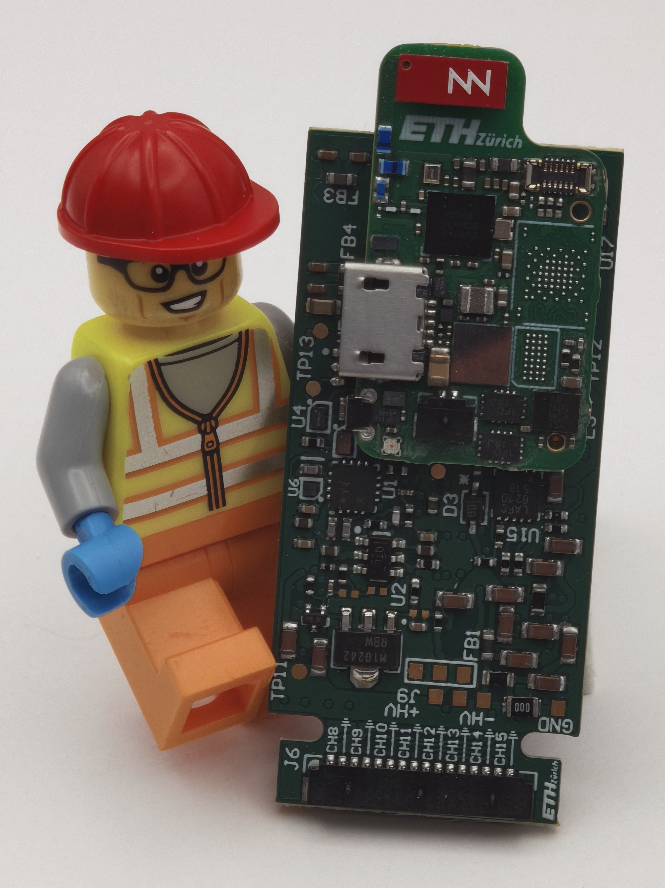

# WULPUS PRO Shield for BioGAP

**Wearable, ultra-low-power ultrasound acquisition for the BioGAP-Ultra platform**  
Initial hardware and firmware release: **v1.0.0**

<p align="center">
  
</p>

The WULPUS PRO shield is a 16-channel, time-multiplexed ultrasound front-end for the [BioGAP-Ultra](https://github.com/pulp-bio/BioGAP) wearable edge-AI platform. It is a successor of the [WULPUS](https://github.com/pulp-bio/wulpus) and [WULPUS-pro](https://github.com/pulp-bio/wulpus-pro) projects and combines high-voltage pulse generation, transmit/receive channel selection, a programmable receive chain, and an MSP430FR5043 ultrasound controller on a compact BioGAP-compatible shield.

This repository contains the **shield hardware** and **MSP430 firmware**. A complete acquisition system also requires compatible BioGAP host firmware and [BioGUI](https://github.com/pulp-bio/biogui), which is the intended desktop application for configuring, visualizing, and recording ultrasound data.

## System Overview

| Component | Responsibility |
| --- | --- |
| **WULPUS PRO shield** | Generates ultrasound pulses, selects transmit/receive channels, conditions echoes, digitizes samples, and exchanges configuration/data with the host over SPI. |
| **BioGAP-Ultra mainboard** | Controls the shield, packages acquired frames, and provides the BLE data link to the host computer. BioGAP-side firmware is maintained in the [BioGAP repository](https://github.com/pulp-bio/BioGAP). |
| **BioGUI** | Provides the BioGAP-Ultra/WULPUS PRO interface, acquisition configuration, live visualization, decoding, and data recording. It is maintained in the [BioGUI](https://github.com/pulp-bio/biogui) repository. |

Configuration flows from BioGUI through BioGAP to the shield. Acquired samples return from the shield over SPI, are transported by BioGAP over BLE, and are reconstructed and displayed by BioGUI.

## Key Features

- **16 time-multiplexed ultrasound channels** for A-mode acquisition.
- **30 V unipolar excitation** with runtime-programmable pulse frequency.
- Support for **piezoelectric and CMUT transducers**, including direct and indirect CMUT biasing in the ±30 V range.
- Low-noise receive path with **up to 70 dB total gain** and programmable time-gain compensation.
- Integrated **12-bit ADC at up to 8 MS/s**.
- MSP430-controlled power domains for the preamplifier, VGA, filter, envelope detector, high-voltage supply, multiplexer, and pulser.
- Standard BioGAP shield connectors for power, SPI, ready/data-ready signaling, and MSP430 programming.


## Repository Structure

| Path | Contents |
| --- | --- |
| [`hardware/`](hardware/) | Altium sources, component libraries, and released manufacturing files for the shield. |
| [`hardware/wulpus_pro_shield/docs/`](hardware/wulpus_pro_shield/docs/) | Schematic and assembly PDFs, BOM, Gerber files, NC drill files, and pick-and-place output. |
| [`firmware/`](firmware/) | MSP430FR5043 firmware project and firmware-specific documentation. |
| [`docs/images/`](docs/images/) | Product photographs and PCB renders used in the documentation. |
| [`CHANGELOG.md`](CHANGELOG.md) | Repository-level release history. |

## Requirements

### Hardware

- A BioGAP-Ultra mainboard and compatible debug/programming hardware.
- An assembled WULPUS PRO shield.
- A compatible piezoelectric or CMUT transducer/array.
- An MSP-FET-compatible programming connection for the MSP430FR5043.

### Software

- A compatible release of the [BioGAP firmware](https://github.com/pulp-bio/BioGAP) with WULPUS PRO support.
- [TI Code Composer Studio](https://www.ti.com/tool/CCSTUDIO) with MSP430 support.
- [BioGUI](https://github.com/pulp-bio/biogui) on the host computer.

## Getting Started

### 1. Manufacture the PCB

Open [`hardware/wulpus_pro_shield/wulpus_pro_shield.PrjPcb`](hardware/wulpus_pro_shield/wulpus_pro_shield.PrjPcb) in Altium Designer to inspect or modify the design. Released manufacturing outputs are under [`hardware/wulpus_pro_shield/docs/`](hardware/wulpus_pro_shield/docs/):

- `BOM/` — bill of materials.
- `Gerber/` — copper, mask, silkscreen, paste, and outline layers.
- `NC Drill/` — drill output.
- `Pick Place/` — component placement data.
- `WULPUS_pro_schematics.PDF` and `WULPUS_pro_shield_assembly.PDF` — review documents.

Review the fabrication package with the PCB manufacturer and assembler before ordering. See [`hardware/README.md`](hardware/README.md) for details.

### 2. Build and Flash the MSP430 Firmware

The project in [`firmware/wulpus_msp430_firmware/`](firmware/wulpus_msp430_firmware/) targets the MSP430FR5043 and was created with Code Composer Studio.

1. Install Code Composer Studio with MSP430 device support.
2. Import `firmware/wulpus_msp430_firmware` as an existing CCS project.
3. Select the **Debug** or **Release** build configuration and build the project.
4. With system power disconnected, connect the MSP-FET programmer to the MSP430 programming interface.
5. Power the assembled system and program the generated `wulpus_msp430_firmware.out` image.

### 3. Flash the BioGAP Mainboard

Build and flash the WULPUS PRO-compatible nRF5340 application from the [BioGAP firmware repository](https://github.com/pulp-bio/BioGAP).

Keep the BioGAP firmware and BioGUI interface versions aligned; their packet format must match.

### 4. Assemble the Stack

1. Disconnect all power and programmers.
2. Check the shield and mainboard connector orientation against the assembly drawings.
3. Plug the WULPUS PRO shield on the BioGAP-Ultra connectors.
4. Connect the transducer or array to the intended channel connector.

### 5. Acquire Data with BioGUI

Install and start BioGUI:

```bash
git clone https://github.com/pulp-bio/biogui.git
cd biogui
uv sync
uv run main.py
```

In BioGUI:

1. Select the **BioGAP-Ultra + WULPUS PRO** board interface. The corresponding implementation is `biogui/platforms/wulpus_pro/interface_biogapultra_wulpus_pro.py`.
2. Connect to the BioGAP device.
3. Configure the transmit/receive channel sequence, pulse settings, acquisition period, sample count, receive gain/time-gain compensation, and optional envelope detector.
4. Start acquisition, verify the live ultrasound trace, and enable recording when required.

With the default firmware configuration, each shield frame contains a 4-byte header followed by 400 16-bit samples.


## Related Projects

- [BioGAP-Ultra](https://github.com/pulp-bio/BioGAP) — mainboard hardware and host firmware.
- [BioGUI](https://github.com/pulp-bio/biogui) — acquisition, visualization, and recording software.
- [WULPUS](https://github.com/pulp-bio/wulpus) — predecessor platform and MSP430 toolchain documentation.
- [WULPUS PRO](https://github.com/pulp-bio/wulpus-pro) — predecessor platform and development kit version of wulpus-pro.


## License

- Hardware under [`hardware/`](hardware/) is licensed under the [Solderpad Hardware License v0.51](hardware/LICENSE).
- Images under [`docs/images/`](docs/images/) are licensed under [CC BY 4.0](docs/images/LICENSE).
- Firmware contains sources under their respective file-header licenses, primarily Apache-2.0 and BSD-style terms. See [`firmware/README.md`](firmware/README.md) and the individual source headers.
